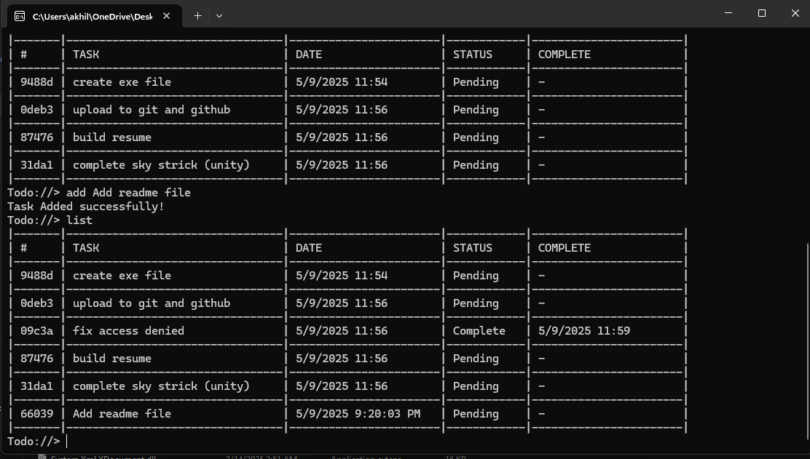
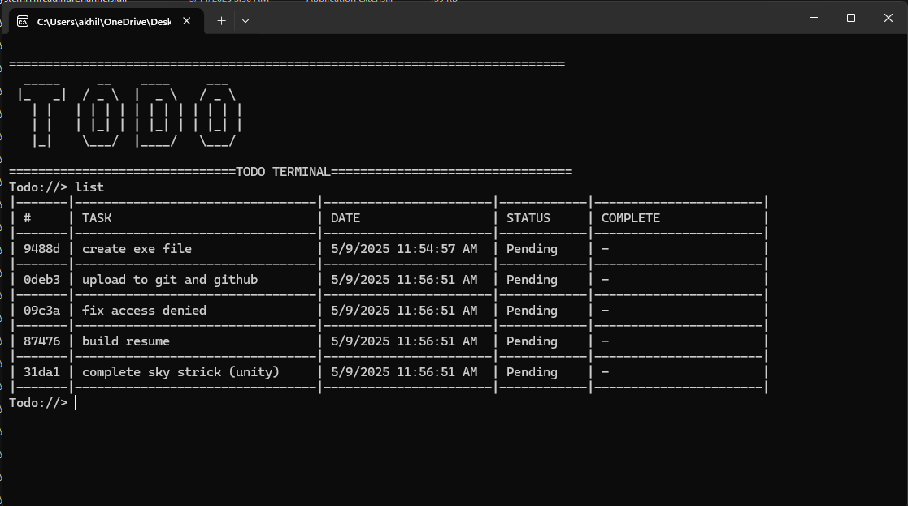
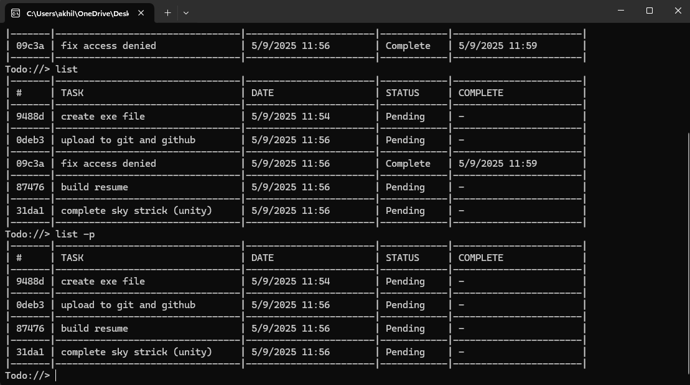
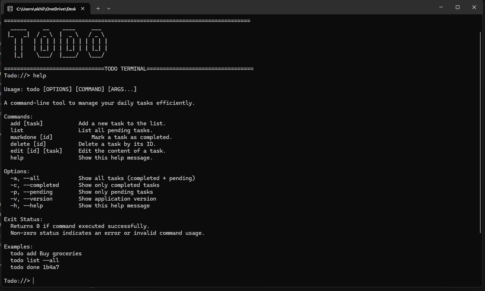

# 📝 To-Do  Console App (.NET C#)

A simple command-line To-Do List application built using C# and .NET. This app allows users to manage their tasks from the terminal with a clean and intuitive interface.

## 🚀 Features

- ✅ Add new tasks
- 📋 View all tasks
- ✏️ Edit tasks
- ❌ Delete tasks
- 📌 Mark tasks as complete/incomplete
- 💾 Save tasks between sessions using local file storagw

## 🛠️ Technologies Used

- .NET 9
- C#

## 🧑‍💻 Getting Started

### Prerequisites

- [.NET SDK](https://dotnet.microsoft.com/download) (version 9 or newer)
- A code editor (e.g., Visual Studio, Visual Studio Code)

### Setup Instructions
## 🔧 Installation

Follow these steps to set up and run the To-Do List Console App on your local machine.

### 1. 📥 Clone the Repository

```bash
git clone https://github.com/AlphaAkhil/TODO.git
cd TODO
```

2. 📦 Install .NET SDK
Make sure the .NET SDK (version 6 or higher) is installed:
```
dotnet --version

```
If not installed, download and install it from the official Download Page.

3. 🛠️ Build the Project
```
dotnet build

```
4. ▶️ Run the Application
```
dotnet run

```
You should now see the interactive TODO App.

## 🖼️ Screenshots

### Adding a Task


### Task List


### Task List

### Task List

### Task List


